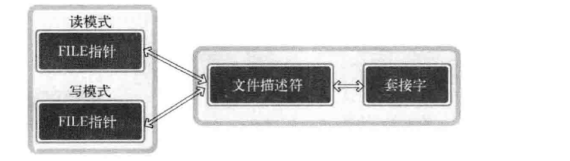
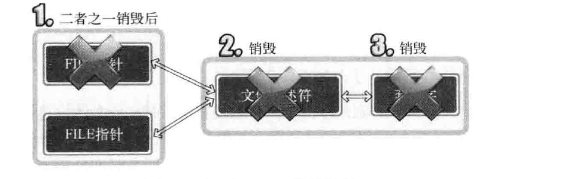
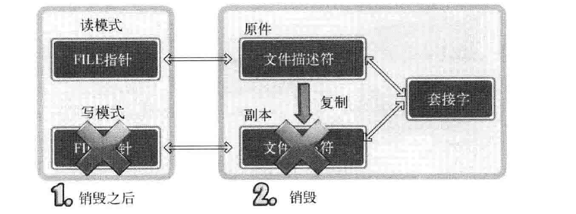
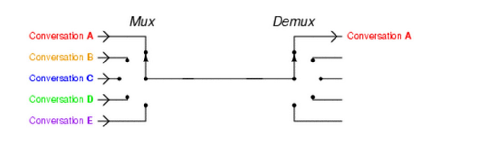

[TOC]

## TCP/IP  笔记


### IO分流

- 概念：读写流分离 （流概念：读取一点点，立刻处理一点点，例如MP4实时解码，一点点字节长度小于人类最高分辨率{视觉处理速度}，看起来连续，反例：等待4GB视频全部下载至内存，解码，播放）

- 优点 

  - 分离读写，代码结构优雅
  - 只读只写的FILE指针提速
  - 区分IO缓冲提速

- 半关闭问题

  

  **单纯调用fclose 转换的FILE指针，直接关闭套接字**



复制文件描述符，并且close，也并非进入半关闭状态。可以操作上面的文件描述符进行IO输出。（未发送EOF） 	

```c
#include <stdio.h>
#include <unistd.h>

int main() {
  int fd1, fd2;
  char str1[] = "hello";
  char str2[] = "world";
  fd1 = dup(1);
  fd2 = dup2(fd1, 7);
  printf("fd1: %d\n,fd2: %d\n", fd1, fd2);
  write(fd1, str1, sizeof(str1));
  write(fd2, str2, sizeof(str2));
  close(fd1);
  close(fd2);
}
```

调用` dup`复制文件描述符，`fdopen`(fd,"r"),打开只读模式，半关闭使用 `shutdown`() 函数 

```c
#include <arpa/inet.h>
#include <netinet/in.h>
#include <stdio.h>
#include <stdlib.h>
#include <sys/socket.h>
#include <unistd.h>
#include <unistdio.h>
#define BUFF_SIZE 1024

int main(int argc, char *argv[]) {
  int server_socket, client_socket;
  FILE *readfp;
  FILE *writefp;
  struct sockaddr_in server_addr, client_addr;
  socklen_t client_addr_size;
  char buf[BUFF_SIZE] = {0};
  server_addr.sin_family = AF_INET;
  server_addr.sin_addr.s_addr = htonl(INADDR_ANY);
  server_addr.sin_port = htons(atoi(argv[1]));

  bind(server_socket, (struct sockaddr *)&server_addr, sizeof(server_addr));
  listen(server_socket, 5);
  client_addr_size = sizeof(client_addr);
  client_socket =
      accept(server_socket, (struct sockaddr *)&client_addr, &client_addr_size);
  readfp = fdopen(client_socket, "r");
  writefp = fdopen(dup(client_socket), "w");
  fputs("from server", writefp);
  fputs("hello from client", writefp);
  fflush(writefp);
  shutdown(fileno(writefp), SHUT_WR);
  fclose(writefp);
  fgets(buf, sizeof(buf), readfp);
  fputs(buf, stdout);
  fclose(readfp);
  return 0;
}
```

### IO复用问题

### 端口复用 打内网   

setsockopt（） SO_REUSEADDR ，

#### 概念:

 **I/O multiplexing 这里面的 multiplexing 指的其实是在单个线程通过记录跟踪每一个Sock(I/O流)的状态(对应空管塔里面的Fight progress strip槽)来同时管理多个I/O流**. 



*ngnix会有很多链接进来， epoll会把他们都监视起来，然后像拨开关一样，谁有数据就拨向谁，然后调用相应的代码处理*

#### select

```c
#include <sys/select.h>

/* According to earlier standards */
#include <sys/time.h>
#include <sys/types.h>
#include <unistd.h>

int select(int nfds, fd_set *readfds, fd_set *writefds,
        fd_set *exceptfds, struct timeval *timeout);

int pselect(int nfds, fd_set *readfds, fd_set *writefds,
        fd_set *exceptfds, const struct timespec *timeout,
        const sigset_t *sigmask);
// 控制fd 和控制组的关系
void FD_CLR(int fd, fd_set *set);   // 移除组
int  FD_ISSET(int fd, fd_set *set); //检测是否存在
void FD_SET(int fd, fd_set *set); // 添加到组
void FD_ZERO(fd_set *set);  //清空组
```

##### 缺陷

1. 通过监视 fd set 组内发生变换的fd，找出可用fd，必然发生轮询
2. fd set 发生变化，调用select时进行比较需先保存原有信息，且产生新的**监视对象信息**（传递给操作系统，开销极大，因为套接字对象受内核管理，存在致命性能弱点）**epoll** 只传递一次

#### epoll

```c
#include <sys/epoll.h>

int epoll_create(int size);
int epoll_create1(int flags);

int epoll_ctl(int epfd, int op, int fd, struct epoll_event *event);

int epoll_wait(int epfd, struct epoll_event *events,
        int maxevents, int timeout);
int epoll_pwait(int epfd, struct epoll_event *events,
        int maxevents, int timeout,
        const sigset_t *sigmask);
```

##### level-triggered

类似于高电平激活（电气学生的理解），条件触发，**允许用户态任意时刻检测**， 只要有IO事件发生（内核通知文件描述符就绪状态） 随便问，内核一直会通知用户态

##### edge-triggered

边缘触发，类似于`沿边触发器`（奇怪的电气学生）只会通知用户一次，假设在一个客户端请求来了，内核收到通知，在文件描述符状态更改的那一瞬间（最小扫描时钟周期）通知用户态，如果用户态程序不处理这个通知，那么此时更改后的状态被内核记录与下一次比较。Bug点:如果忽略掉一次内核通知，想再获取只能等待文件描述符的状态再次改变（沿边触发！）(好家伙，万一次没读到，直接GG！

写程序注意把套接字改成非阻塞模式，否则停顿，另外需要一次性处理完全部数据，以为只有一次机会

```c
#include<unistd.h>
#include<stdlib.h>
#include<stdio.h>
#include<string.h>
#include<sys/socket.h>
#include<arpa/inet.h>
#include<sys/epoll.h>

#define BUF_SIZE 4
#define EPOLL_SIZE 64

void errorHandler(const char* message){
    perror(message);
    exit(1);
}

int main(int argc, char* argv[]){
    if(argc != 2){
        printf("Usage: %s <port> \n", argv[0]);
        exit(1);
    }

    int sockServ = socket(PF_INET, SOCK_STREAM, 0);

    sockaddr_in servAddr;
    memset(&servAddr, 0, sizeof(servAddr));
    servAddr.sin_family = AF_INET;
    servAddr.sin_addr.s_addr = htonl(INADDR_ANY);
    servAddr.sin_port = htons(atoi(argv[1]));

    if(-1 == bind(sockServ, (sockaddr*)&servAddr, sizeof(servAddr))){
        errorHandler("bind error!");
    }

    if(-1 == listen(sockServ, 5)){
        errorHandler("listen error!");
    }

    int epfd = epoll_create(EPOLL_SIZE);

    epoll_event event;
    event.data.fd = sockServ;
    event.events = EPOLLIN;

    epoll_ctl(epfd, EPOLL_CTL_ADD, sockServ, &event);

    epoll_event* pEvents;
    pEvents = (epoll_event*)malloc(sizeof(epoll_event)*EPOLL_SIZE);

    int eventCount;
    char buf[BUF_SIZE];
    int sockClient;
    int readLen;

    while(1){
        eventCount = epoll_wait(epfd, pEvents, EPOLL_SIZE, -1);
        puts("epoll_wait...");

        for(int i=0;i<eventCount;i++){
            if(pEvents[i].data.fd == sockServ){ // client connected...
                sockClient = accept(sockServ,0,0);
                printf("Client %d connected...\n", sockClient);

                event.data.fd = sockClient;
                event.events = EPOLLIN;

                epoll_ctl(epfd, EPOLL_CTL_ADD, sockClient, &event);
            }
            else{
                readLen = read(pEvents[i].data.fd, buf, BUF_SIZE);
                if(readLen == 0){   //client disconnected...
                    epoll_ctl(epfd, EPOLL_CTL_DEL, pEvents[i].data.fd, NULL);
                    close(pEvents[i].data.fd);
                }
                else{
                    write(pEvents[i].data.fd, buf, readLen);
                }
            }
        }
    }

    close(sockServ);
    close(epfd);
    return 0;
}
```

